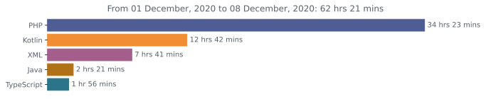

<h1 align="center">Hi there 👋</h1>

- 🔭 I’m currently working on TGI




<!--START_SECTION:waka-->
```text
Week: 25 November, 2020 - 02 December, 2020

PHP          28 hrs 12 mins  ████████████▓░░░░░░░░░░░░   50.50 % 
Kotlin       17 hrs 24 mins  ███████▓░░░░░░░░░░░░░░░░░   31.17 % 
XML          3 hrs 12 mins   █▒░░░░░░░░░░░░░░░░░░░░░░░   05.75 % 
TypeScript   2 hrs 50 mins   █▒░░░░░░░░░░░░░░░░░░░░░░░   05.08 % 
JSON         1 hr 6 mins     ▒░░░░░░░░░░░░░░░░░░░░░░░░   01.97 % 
```
<!--END_SECTION:waka-->
